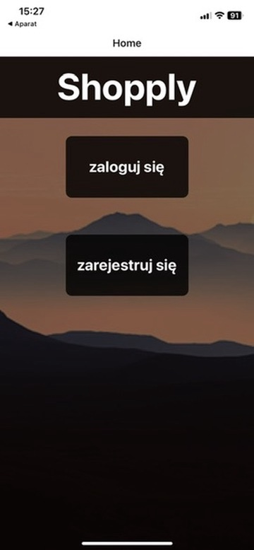

# Shopply
Shopping manager application. User can add a product to products-to-buy list and afterwards mark as bought. Products can be filtered by price or shop.

## Introduction
Keep in mind that there is no database used in this project, all data is stored in components state. So all data entered by the user will disappear after restarting application.

There are some data predefined for testing purposes:
* Users: login: `login: admin password: admin`, `login: user password: user`
* Products: there are also some products prepared for testing purposes



## Technologies
* JavaScript
* React Native

## Main functionalities
* Registration
* Login
* Adding new item to shopping list
* Marking item as bought
* Editing item
* Checking item details
* Removing item from shopping list
* Filtering items by price or shop

## Running the application
Bearing in mind that this is a mobile application, launching it is not the easiest.

### Snack Expo
1. Go to:
```
https://snack.expo.dev
```
2. Create account
3. Create new snack
4. Move this project there
5. Choose emulator: `Android` or `iOS`